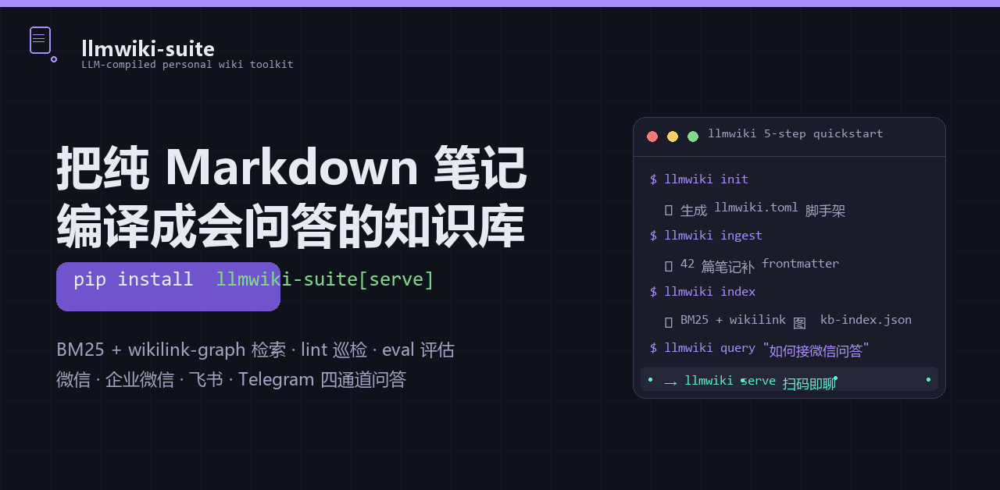

# llmwiki-suite

<p align="center">
  
</p>

> 🌐 [English](README.en.md) · 中文
>
> **把一堆 Markdown 笔记，编译成「会生长、能问答」的个人知识库。**

[](https://pypi.org/project/llmwiki-suite/)
[](https://pypi.org/project/llmwiki-suite/)
[](https://github.com/voidvec/llmwiki-suite/actions/workflows/ci.yml)
[](https://github.com/voidvec/llmwiki-suite/actions/workflows/release.yml)
[](LICENSE)

源自 Karpathy 的 LLM-wiki 思路：不做每次查询临时切片的 RAG，而是用工具链
**持续编译**笔记——补 frontmatter、建 BM25 + wikilink 图索引、巡检断链，
最后通过 CLI 或微信 / 企微 / 飞书 / Telegram 通道问答。

目标是让个人知识库**只进不退**：每一条笔记都被规范化、可检索、可追问，
而不是躺在文件夹里堆灰。

---

## 快速体验（30 秒）

```bash
# 一条命令装好全部能力（核心 + 服务/通道运行时）
pip install "llmwiki-suite[serve]"

# 五步接入你已有的笔记库
cd ~/my-notes           # 你的 Markdown 笔记目录
llmwiki init            # 生成 llmwiki.toml + 脚手架
llmwiki ingest          # 补 frontmatter + 规范化 wikilink
llmwiki index           # 建 BM25 + wikilink 图索引
llmwiki query "..."     # 检索 / 问答 / 输出完整回答
```

> **包名 vs 命令名**：PyPI 发布名为 **`llmwiki-suite`**（`llmwiki` 包名已被占用），
> 安装后命令仍是 **`llmwiki`** —— 装 `llmwiki-suite`，用 `llmwiki`。

## 安装

> 已在 PyPI 发布。**推荐直接装 `serve` 版**（核心 + 跑 `llmwiki serve` 所需的
> fastapi/uvicorn，也是所有通道——微信/企微/飞书/Telegram 共用的运行时）；
> 只看检索/巡检则装核心版（零第三方依赖）。

```bash
# 推荐：一条命令装好【全部能力】（核心 + 通道时代 fastapi/uvicorn）
pip install "llmwiki-suite[serve]"

# 轻量：只装核心（ingest / index / query / lint / eval，零第三方依赖）
# pip install llmwiki-suite
```

要求 Python >= 3.11。

### 本地开发安装（源码）

推荐在**项目级虚拟环境**中安装（与 CI 同构、依赖隔离）：

```bash
git clone https://github.com/voidvec/llmwiki-suite.git
cd llmwiki-suite
python -m venv .venv
# Windows: .venv\Scripts\activate     macOS/Linux: source .venv/bin/activate
pip install -e ".[wechat,dev]"       # 全部通道 + 测试/pre-commit 依赖
pre-commit install                   # 注册仓库级钩子（可选但推荐）
```

## 五步接入你已有的笔记库

```bash
cd ~/my-notes          # 1. 进入你的笔记目录
llmwiki init           # 2. 生成 llmwiki.toml 配置模板
llmwiki ingest         # 3. 补 frontmatter + 规范化 wikilink
llmwiki index          # 4. 建检索索引
llmwiki query "..."    # 5. 检索 / 问答
```

可选：`llmwiki lint`（巡检断链/词表）、`llmwiki eval`（召回质量评估：recall@k / MRR）、
`llmwiki serve`（启动 HTTP 问答服务，需 `serve` extras）。

## 命令一览

| 命令 | 作用 |
|------|------|
| `llmwiki init` | 在目标库生成 `llmwiki.toml` 模板 + 脚手架（.gitignore / pre-commit / CI） |
| `llmwiki ingest` | 扫描笔记，补齐 frontmatter，规范化 wikilink 命名 |
| `llmwiki index` | 生成 BM25 + wikilink 图检索索引（`kb-index.json`） |
| `llmwiki query "..."` | 召回最相关章节；配置 `LLM_WIKI_API_KEY` 后基于召回结果生成完整回答 |
| `llmwiki lint` | 巡检：断链、词表越界、命名规范 |
| `llmwiki categories-sync` | 从索引派生全部实际类别并写回 `llmwiki.toml`（`--apply` 写入） |
| `llmwiki eval` | 用 `<repo>/eval_queries.json` 跑 recall@k / MRR；无评估集可 `--seed` 采样生成，`--demo` 跑内置示例集（`--chart` 输出自包含 SVG 图） |
| `llmwiki serve` | 启动 FastAPI 桥接服务（`/chat` `/recall` `/healthz`，及 `/webui/chat` 网页问答、`/dashboard` 工作台） |

所有命令支持 `--repo <path>` 显式指定库路径（默认取当前目录）。

## 渠道接入（微信 / 企业微信 / 飞书 / Telegram）

用 `llmwiki serve` 把知识库接到 IM，直接发消息问答：

```bash
# ① 已装渠道版则直接可用；否则先补装渠道依赖
pip install "llmwiki-suite[serve]"

# ② 配置 LLM（OpenAI 兼容端点；只设 KEY 时默认走 OpenAI）
export LLM_WIKI_API_KEY="sk-xxx"
export LLM_WIKI_BASE_URL="https://api.openai.com/v1"        # 不设则默认 OpenAI
export LLM_WIKI_MODEL="gpt-4o-mini"                          # 不设则默认 gpt-4o-mini

export LLM_WIKI_BRIDGE_TOKEN="my-secret"       # 可选：保护问答接口（本地验证通道可忽略）
llmwiki serve --host 127.0.0.1 --port 8000
```

- **网页问答**：浏览器打开 `http://127.0.0.1:8000/webui/chat` → 直接输入问题问答（带引用来源）；
  总览入口 `http://127.0.0.1:8000/dashboard`（索引健康 + 通道状态 + 各功能入口）。
- **个人微信（推荐，免费官方 iLink 通道）**：浏览器打开
  `http://127.0.0.1:8000/ilink/webui` → 手机微信扫码 → 绑定后在微信里直接给 bot 发消息即查即答。
- **企业微信**：配置 `LLM_WIKI_WECOM_*` 环境变量后自动启用回调 / 主动推送通道。
- **飞书**：配置 `LLM_WIKI_FEISHU_APP_ID` / `LLM_WIKI_FEISHU_APP_SECRET`（可选
  `LLM_WIKI_FEISHU_VERIFY_TOKEN` 签名校验），回调地址设为 `https://<你的域名>/feishu/callback` 即可。
- **Telegram**：用 @BotFather 建 bot 得 token，配置 `LLM_WIKI_TELEGRAM_BOT_TOKEN`，
  webhook 指向 `https://<你的域名>/telegram/callback`。
  （webhook 需公网可达地址：可用 frp / ngrok / 腾讯云轻量等反代到 8000。）

> **路由总是注册**：`serve` 启动时四个通道的路由无条件挂载，缺凭据时返回可读的 `hint`
> （不会 404）。可通过 `http://127.0.0.1:8000/healthz` 查看各通道 `configured / enabled` 状态。

### 换 LLM 厂商 / 模型（OpenAI 兼容协议即可）

套件只调 OpenAI 兼容的 `/chat/completions`，**不看厂商名**——任何提供该协议的服务都能用：

| 厂商 | `LLM_WIKI_BASE_URL` | `LLM_WIKI_MODEL` |
|------|---------------------|------------------|
| OpenAI（默认） | `https://api.openai.com/v1` | `gpt-4o-mini` |
| DeepSeek | `https://api.deepseek.com/v1` | `deepseek-chat` |
| 通义千问 | `https://dashscope.aliyuncs.com/compatible-mode/v1` | `qwen-plus` |
| Kimi / Moonshot | `https://api.moonshot.cn/v1` | `moonshot-v1-8k` |
| 本地 Ollama | `http://127.0.0.1:11434/v1` | `qwen2.5:7b`（API_KEY 随便填） |

> 任意 OpenAI `/chat/completions` 兼容服务（DeepSeek / 通义 / Kimi / 本地 Ollama / vLLM 等）都行。
> 完整对接、会话持久化与排错见 [[llmwiki-tutorial-02-channel]]。

## 配置与密钥

- **库配置**：库根 `llmwiki.toml`（categories 词表、排除目录、模型名等非密钥项）
- **密钥**：只走环境变量（`LLM_WIKI_API_KEY`、`LLM_WIKI_BRIDGE_TOKEN`（可选）、
  `LLM_WIKI_WECOM_*`、`LLM_WIKI_ILINK_*`、`LLM_WIKI_FEISHU_*`、`LLM_WIKI_TELEGRAM_*`），
  本套件不读任何 `.env` 文件

## 文档

全部文档在 `docs/`，按「入口 → 进阶 → 参考」组织：

| 文档 | 说明 |
|------|------|
| `docs/getting-started.md` | **入口**：五步接入已有笔记库（10 分钟上手） |
| `docs/tutorials/llmwiki-tutorial-01-system.md` | 体系搭建完整教程：目录规范、Ingest / Query / Lint、自动化 |
| `docs/tutorials/llmwiki-tutorial-02-channel.md` | 渠道接入：微信 / 企业微信桥接、serve 部署 |
| `docs/tutorials/llmwiki-tutorial-03-quality-tuning.md` | 检索质量调优：评估集、诊断、调参 |
| `docs/llmwiki-eval.md` | **命令参考**：eval 全部选项、评估集 schema、报告字段、指标解读 |
| `docs/llmwiki-evolution-roadmap.md` | **路线图**：从被动问答到知识库自进化（L0→L3） |
| `docs/llmwiki-architecture.md` | 系统架构：分层设计、通道抽象 |

建议顺序：getting-started → tutorial-01 → 02/03（按需）→ architecture。

## 参与贡献

- 想提 bug / 功能？开 [Issue](https://github.com/voidvec/llmwiki-suite/issues/new/choose)
- 想参与开发？见 [CONTRIBUTING.md](CONTRIBUTING.md)（本地开发环境、测试、提交规范）
- 安全相关？见 [SECURITY.md](SECURITY.md)（漏洞报告、密钥与 env 规范）
- 有想法想聊？来 [Discussions](https://github.com/voidvec/llmwiki-suite/discussions)
- 一键支持：点亮 ⭐ Star，让更多人被搜索到

## License

[MIT](LICENSE)

---

## 作者与公众号

作者：[voidvec](https://github.com/voidvec)

公众号持续输出：
- LLM / RAG / 知识库的第一手踩坑记录
- 这套工具链的演进连载（从 L0 被动问答到 L3 自进化）
- 开源项目从 0 到 1 的全过程复盘

<p align="center">
  
  <br/>
  <b>搜索「[王小c]」关注</b>（可 Q 我）
</p>