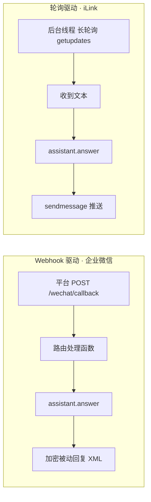
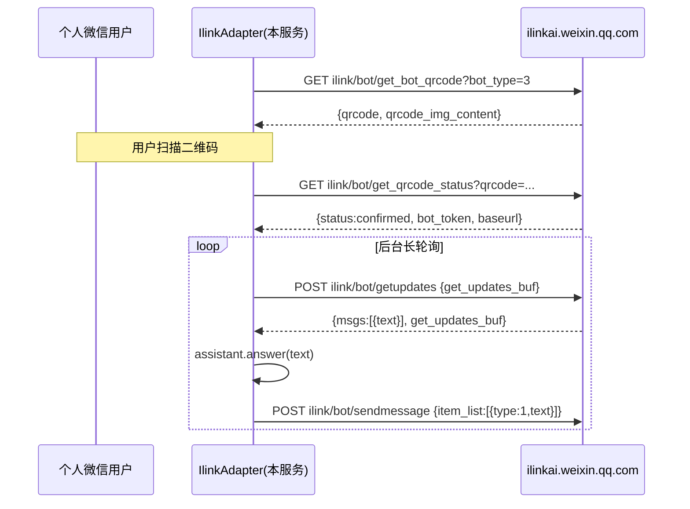

# LlmWiki 架构梳理（分层 + 微信通道）

> 角色：Software Architect。本文把 llmwiki-suite 套件的**已实现**架构完整梳理一遍，
> 重点：**应答编排 + 通道层**与传输解耦的清晰分层，
> 并把**腾讯 iLink Bot API** 落地为个人微信通道（替代原方案里需 ¥299/年 Wechaty puppet 的路线）。

---

## 1. 顶层分层

```mermaid
flowchart TB
    subgraph CH[通道层 ChannelAdapter]
      WECOM[WeComAdapter<br/>Webhook 驱动]
      ILINK[IlinkAdapter<br/>轮询驱动]
    end
    CH -->|on_message(text,user)| ASSIST[KbAssistant<br/>应答编排层]
    ASSIST -->|recall| RETRIEVE[KbRetriever<br/>召回层]
    RETRIEVE -->|读源 .md| CORE[kb_core<br/>铁律/FM/词表]
    RETRIEVE -->|启动加载| IDX[(kb-index.json<br/>单一事实源)]
    ASSIST -->|拼 prompt + 调 LLM| LLM[(OpenAI 兼容<br/>/chat/completions)]
    IDX -. 由 _gen_query_index.py 生成 .-> RETRIEVE
    subgraph BG[后台自动化]
      LINT[lint.py]
      INGEST[ingest.py]
    end
    BG -. 写入/校验 .-> IDX
```

五层职责（自下而上）：

| 层 | 模块 | 职责 | 三方依赖 |
|---|---|---|---|
| 存储/索引 | `kb-index.json`（生成器 `llmwiki index`） | 单一事实源：16 字段文档（含正文 `body_text` / `body_text_clean` 双变体）+ 分类/标签倒排表 | 无 |
| 召回 | `recall.py` → `KbRetriever` | BM25 召回（K1=1.5/B=0.75，正文索引 + Wikilink 图扩展补位，`min_score=0.15` + 每词阈值 1.0 查询长度感知门槛）+ 章节级取数 + 索引过期检测（P3：`check_freshness()` 磁盘指纹三向比对，~11 ms/188 篇） | 无（标准库） |
| 共享核心 | `kb_core.py` | 链接判死铁律、frontmatter 解析、受控词表（唯一事实源） | 无 |
| 应答编排 | `assistant.py` → `KbAssistant` | 召回 → 拼 prompt → 调 LLM → 附来源（与传输解耦） | 无（urllib 调 LLM） |
| 通道 | `channel_base.py` + `wecom_adapter.py` + `ilink_adapter.py` | 把外部消息翻译成 `assistant.answer()` 调用，再把回答送回 | WeCom 需 fastapi/pycryptodome；iLink 仅标准库 |
| 传输/编排 | `channels/wechat_bridge.py`（FastAPI） | 装配 KbAssistant + 通道；生命周期；对外 HTTP 端点 | fastapi/uvicorn |

**关键原则**：索引是单一事实源，`llmwiki index` 是所有写入路径的最后一环；
链接铁律与受控词表只在 `kb_core.py` 实现一次，召回/lint/ingest 共用，避免三处各写一套再各自踩坑。

---

## 2. 通道层：`ChannelAdapter` 为什么要抽象两类驱动

微信类通道本质有两种驱动模型，必须收口成统一接口，否则桥接服务会充斥 `if channel==` 分支：



`ChannelAdapter`（抽象基类）据此定义：

- `register_routes(app)` —— **Webhook 驱动**适配器在此挂 FastAPI 路由（如 `WeComAdapter`）。
- `start()` / `stop()` —— **轮询驱动**适配器据此管理后台线程（如 `IlinkAdapter`）。
- `health()` —— 状态上报，供 `/healthz` 聚合。
- 构造函数统一注入 `KbAssistant`，通道差异被完全封装。

桥接服务只做：`实例化已配置的适配器 → 调 register_routes → startup 调 start → 端点委托`。

---

## 3. 个人微信路线：为什么选 iLink（替代 Wechaty puppet）

接「个人微信」三条路对比（来自对 cc-go 项目的逆向分析）：

| 路线 | 成本 | 稳定性 | 跨平台 | 机制 |
|---|---|---|---|---|
| 本地 hook（wcferry / gewechat） | 免费 | 有封号风险，mac/Linux 难跑 | 仅 Windows 桌面微信 | 注入客户端内存 hook |
| Wechaty + 商业 puppet（PadLocal） | ≈¥299/年 | 较稳 | 跨平台 | 模拟 iPad 协议 |
| **腾讯 iLink Bot API（本仓库默认）** | **免费·官方** | 受平台开放度摆布 | **无头跨平台** | 个人号扫码注册成 bot，经官方网关 |

**决策**：个人微信默认走 **iLink**。理由——

- cc-go 证明：iLink 是腾讯官方 bot 网关（`ilinkai.weixin.qq.com`，`bot_type=3` 个人号），
  扫码绑定即获 `bot_token`，收发都走官方 HTTP，**不是逆向协议、不驱动客户端**，
  因此无 puppet 费用、无头跨平台（mac/Linux 服务器也能跑）。
- 企业客服/需稳定 SLA 的场景仍用**企业微信**（`WeComAdapter`）。
- Wechaty 仅作后备（若 iLink 平台权限收紧）。

> 诚实边界：iLink 需先有平台开放权限；消息经腾讯云而非 P2P；历史上有过网页微信 bot 等被关的先例，
> 受平台开放度摆布。v1 适配器仅做文本问答（图片/文件走官方 CDN AES-ECB，复杂度高，本期未实现）。

### iLink 契约（与 cc-go 逐字段对齐）



- 鉴权头：`AuthorizationType: ilink_bot_token` + `Authorization: Bearer <bot_token>` + `X-WECHAT-UIN: base64(rand)`。
- `bot_token` 持久化到 `.ilink_session.json`（**已加 `.gitignore`，绝不入库**）；<24h 有效，过期自动给最近联系人推重激活链接。

---

## 4. 安全与部署边界

- **网关令牌**：`/chat`、`/recall` 受 `LLM_WIKI_BRIDGE_TOKEN` 保护；服务默认绑 `127.0.0.1`，仅企业微信回调经内网穿透面向公网（沿用第二次评审 R3）。
- **凭证全部走环境变量**，绝不硬编码（`LLM_WIKI_*` 前缀下：`API_KEY` / `BRIDGE_TOKEN` / `WECOM_*` / `ILINK_*`）。
- **iLink 无需公网**：客户端主动出网长轮询，家庭宽带即可；企业微信回调才需公网/穿透。
- **离线可跑**：LLM 未配置时 `/chat` 降级返回检索片段预览；iLink 无 token 时后台空闲不触网。

---

## 5. 与个人知识库（个人库 scripts/）的关系

- 本套件由个人库的 `scripts/` 引擎 pip 化而来：模块一一对应（`recall.py`⇄`kb_recall.py`、`assistant.py`⇄`kb_assistant.py`、`ingest.py`⇄`_ingest_normalize.py`、`lint.py`⇄`lint_kb.py`、`gen_index.py`⇄`_gen_query_index.py`）。
- 核心改造：**去掉 `.git` 锚定仓库根**（`REPO_DEFAULT`），改为 D3 解析链（`--repo` → CWD 向上找 `.git` → CWD 含 .md）；受控词表 / 排除目录从硬编码抽到 `llmwiki.toml` 三层配置。
- 个人库以 **S3 自举**方式切为套件消费者：`pip install -e ../llmwiki-suite`（已落地，2026-08-24）。
  - 验收①召回等价：个人库 57 条评估集跑套件 `llmwiki eval`，**recall@4=100%、MRR@4=0.9605**，与迁移前 `kb_recall` 基线逐位一致（含 avg_rank 1.11、missed 空）。
  - 验收②lint 等价：套件 `llmwiki lint`（191 文件）与本地 `lint_kb.py` 同为 0 errors / 199 warnings，逐项一致。
  - 消费入口：个人库日常 `llmwiki query / ingest / index / lint / eval / serve` 全部由套件 CLI 提供；个人库 `scripts/` 保留为历史实现与桥接编排，不再需要双源同步（新增能力只在套件侧演化，个人库通过 `-e` 直接消费）。
