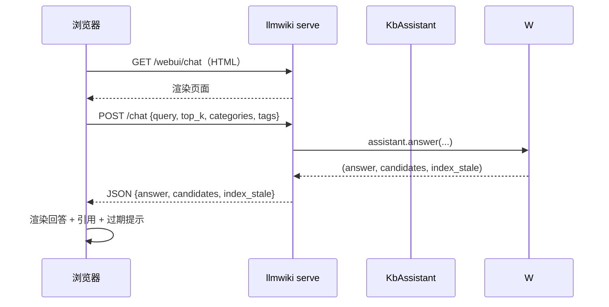

# llmwiki 网页问答与工作台设计（`/webui/chat` + `/dashboard`）

> 角色：Software Architect。本设计为 llmwiki-suite 补齐「浏览器侧的问答体验」：
> 现状 `llmwiki query` 与 `POST /chat` 都是无界面形态，本文设计网页问答页与导航工作台，
> 明确其与既有 `/chat`、`/ilink/webui` 的关系，并给出**服务暴露形态（仅自己 A / 团队内网 B）**下的安全模型与分阶段实施计划。
>
> **本文档保存本地，仅作评审与实施依据，不提交远程**；待实施完成后，按其"联动更新"清单更新 `llmwiki-suite` 的相关文档。

---

## 0. TL;DR（结论先行）

| 决策点 | 结论 |
|---|---|
| 聊天端点放哪？ | `/chat` 保持为**纯 JSON API**（机器对机器）；新增 **`GET /webui/chat`** 为**带界面的网页问答页**。两者共用同一后端 `assistant.answer()`。 |
| 与 `/ilink/webui` 的关系？ | `/ilink/webui` 是 iLink 微信通道的**扫码绑定页**（一次性流程），**不属于问答**，保持通道专属、互不合并。 |
| 要不要 `/dashboard` 统一管理？ | 要，但是**导航中枢 + 状态聚合**，不是承载各页面的容器：统一入口，聚合通道健康/索引新鲜度，各功能页保持独立端点。 |
| 暴露形态？ | 只支持两种：**A 仅自己**（Tailscale 组网）与 **B 团队内网**（反代 + 网关认证）。**套件永远只监听 `127.0.0.1`**，不直连公网。 |
| 会话保护？ | **P4 取消**（经确认不做）。A/B 形态下认证在网关/设备层完成，套件内部不引入登录/session。 |
| 实施优先级？ | P0（`/webui/chat` 页）→ P1（`/dashboard` 工作台）→ P2（路由收敛）→ P3（SSE 流式，可选）。 |

---

## 1. 现状盘点（为什么需要这个设计）

### 1.1 现有端点（`serve` 内）

| 端点 | 方法 | 用途 | 状态 |
|---|---|---|---|
| `/api/chat` | POST | JSON 对话接口（query → answer + candidates） | ✅ 正式机器接口（P2 已收敛），受 `BRIDGE_TOKEN` 保护 |
| `/api/recall` | POST | JSON 召回调试接口 | ✅ 正式机器接口（P2 已收敛） |
| `/chat` `/recall` | POST | **兼容别名**，等价 `/api/*` 同路径 | ✅ 保留可用（P2） |
| `/ilink/qrcode` `/ilink/activate` `/ilink/status` | GET/POST | iLink 通道二维码/激活/状态 | ✅ 已有 |
| `/ilink/webui` | GET(HTML) | iLink 微信**扫码绑定页**（HTML） | ✅ 已有 |
| `/healthz` | GET | 健康检查（含各通道状态） | ✅ 已有 |

### 1.2 核心缺口

- `llmwiki query` / `POST /chat` 都是**纯接口、无界面**——在浏览器里没有"输入框 → 回答"的体验。
- `/ilink/webui` 只服务 iLink 通道的**绑定环节**，不是通用问答页。
- 没有**总的导航/入口页**，多端点（通道、问答、检索、运维）散落，靠人记 URL。

### 1.3 分层原则（写进套件约定）

| 前缀 | 职责 | 鉴权 | 代表端点 |
|---|---|---|---|
| `/api/*` | 纯机器接口（JSON） | 统一 token（`BRIDGE_TOKEN`） | `/api/chat`（未来收敛） |
| `/webui/*` | 人用页面（HTML） | 继承"能访问到 `127.0.0.1:8000` 即已过身份"（网关层决定） | `/webui/chat` |
| `/dashboard` | 总览工作台（HTML） | 同上 | `/dashboard` |
| `/{channel}/*` | 通道专属 | 通道线下口令 | `/ilink/*` |

> 现行 `/chat`、`/recall` 已作为兼容别名保留（P2 已实施），正式机器接口收敛到 `/api/*`；`/webui/*` 作为新页面的固定前缀先行落地。

---

## 2. 端点设计

### 2.1 P0 — `GET /webui/chat`（网页问答页）

**目标**：浏览器打开即用，输入问题 → 出回答 + 引用列表。自包含 HTML（内嵌 style/script，**无外部 CDN、无构建**），与现有 `/ilink/webui` 一致的实现风格。

**页面 UX**：
- 单栏对话，顶部可折叠"筛选"：`top_k`、分类（categories）、标签（tags）
- 回答正文下方**引用卡**：`path`（可点击）、`title`、`score`
- 索引过期时（`index_stale` 非空）醒目提示"建议 `llmwiki index`"

**数据流**：


**安全**：页面复用现有 `/chat` 的鉴权。当前无 `BRIDGE_TOKEN` 时，`/chat` 报错 → 页面兜底显示"服务端未配置提问口令"。

---

### 2.2 P1 — `GET /dashboard`（导航工作台）

**目标**：`serve` 之后一个入口看到"这个库能干嘛、谁在用、还健康吗"。

**页面内容**：
- 顶部：库名 / 仓库路径 / 文档数（来自 `kb-index.json`）
- 通道状态卡片（来自 `/healthz`）：
  - iLink → 去 `/ilink/webui` 绑定；已连接则显示 ✔
  - 通用问答 → 去 `/webui/chat`
  - 可展示: WeCom / Feishu / Telegram 的配置状态
- 索引健康：索引新鲜度（`check_freshness()` → 过期提示"`llmwiki index`"）、入口到 `llmwiki lint` 说明
- 底部：API 说明（`/api/` 待收拢）、安全模型说明

**实现**：也是一页自包含 HTML（复用 `/ilink/webui` 的零依赖风格），数据从 `/healthz` + 一个轻量状态聚合端点（可先内联在 dashboard 视图里）。

---

### 2.3 P2 — 路由收敛（✅ 已实施，语义见上）

| 动作 | 说明 |
|---|---|
| `/chat` → 保留别名 | 保持可用，作为 `POST /api/chat` 的兼容别名 |
| `/recall` → 保留别名 | 同上 |
| 新增 `/api/*` | 文档化的机器接口前缀，用于未来脚本/第三方 |
| `/ilink/*` | 保持通道专属，不进 `/api/` |

> 收敛已同步更新 README / docs 中的调用示例，旧 URL 不破坏（别名 + 兼容）。

---

### 2.4 P3 — SSE 流式（✅ 已实施）

- `POST /api/chat` 在 `Accept: text/event-stream` 或 `?stream=1` 时走 SSE 流式
- 事件序列：`meta`（索引过期告警）→ `candidates`（引用卡）→ `delta*`（回答增量）→ `done`（全文）
- 网页问答页已接入打字机效果 + 「停止」按钮（`AbortController` 中断）；无 `ReadableStream` 时降级 JSON
- 依赖 `assistant.answer_stream`（新增，`call_llm_stream` 对 urllib 做 stream=True 逐 chunk 读取；
  未配置 key / 端点异常时降级为一次性片段预览，与 `answer()` 同语义）
- 好处：长时间 LLM 生成时用户有反馈、可中断；成本：改造了 assistant（+stream 方法）+ bridge（+SSE 分流）+ 前端（打字机）

---

## 3. 暴露形态（A / B）与安全模型

### 3.1 形态定义（只支持这两种，暂不做第三种）

| 形态 | 场景 | 示例 | 认证层 | 套件侧配置 |
|---|---|---|---|---|
| **A · 仅自己** | 个人知识库 | Tailscale / ZeroTier | 设备级认证（组网即身份） | `--host 127.0.0.1` |
| **B · 团队内网** | 十来人团队 | 内网 IP + 反向代理（Caddy/Nginx） | 网关 Basic Auth / 内网 SSO | `--host 127.0.0.1` |

### 3.2 架构：llmwiki 不直连公网

```
公网 / 外网
   │
   ▼
【网关 / 反代】  Caddy / Nginx / Tailscale
  • HTTPS 证书（仅在 B 形态需要）
  • 认证收口（Basic Auth / 组网设备）
  • 速率限制 / 路径过滤（可配）
   │  （仅内网回环）
   ▼
【llmwiki serve】 --host 127.0.0.1:8000
   • /webui/*  页面
   • /chat /recall 接口（BRIDGE_TOKEN 仅内网可信段流通）
   • /ilink/*  通道
```

**为什么 `/webui/*` 需要继承"已过网关"信任**：
- 形态 A（Tailscale）：操作系统/设备级认证已强于任何套件 session 方案
- 形态 B（内网反代）：网关 Basic Auth 一行解决认证，套件无需重复造轮子
- 因此：**当前两种形态下套件系统不做登录态**，`/webui/*` 依赖网关层隔离公网

### 3.3 安全模型（3 条原则）

1. **身份分层**：网关认"人/设备"（账号 / 组网），套件认"机器"（`BRIDGE_TOKEN`），接口层与页面层预期保持互通但互相兜底。
2. **`/api/*` 只对内**：若未来收敛后暴露公网，网关必须把 `/api/*` 路径给挡住（`/webui/*` 放行）。
3. **成本意识**：问答提供 LLM 是有成本、有内容的。A/B 形态下（尤其 B）**一定要网关侧限流**，否则被爬会把 token 烧光。

> 补一句：P4"会话保护"经评审确认**不做**。真到未来需要对公产品化（形态 C），再另行引入网关级 SSO / OIDC，超套件定位范围。

---

## 4. 实施计划（分阶段，可独立验收）

| 阶段 | 内容 | 验收标准 | 依赖 | 备注 |
|---|---|---|---|---|
| **P0** | `GET /webui/chat` 自包含问答页 | 浏览器打开即问答，回答带引用列表 | 现有 `/chat` | 不引入鉴权、不碰既有路由 |
| **P1** | `GET /dashboard` 工作台 | 一眼看到各入口 + 通道健康 | P0 | 复用 `/healthz` |
| **P2** | 路由收敛到 `/api/*`（+ 保留别名） | 旧 URL 仍可用、文档同步 | 无 | 只做迁移类改动 |
| **P3** | `POST /api/chat` SSE 流式 | 打字机回答，可中断 | P2 | ✅ 已实施 |
| ~~P4~~ | ~~会话保护~~ | — | — | **取消**（确认 A/B 形态下不做） |

### 验收清单（P0 完成时）

- [ ] `GET /webui/chat` 返回自包含 HTML（无外部依赖）
- [ ] 页面输入问题 → 调用 `POST /chat` → 展示回答 + 引用
- [ ] 无 `BRIDGE_TOKEN` 时页面明确提示
- [ ] `index_stale` 时页面显示"建议 `llmwiki index`"
- [ ] 现有 `/ilink/webui`、`/healthz`、`/chat` 行为不变（回归）

---

## 5. 实施完成后要联动的文档（本设计未提交远程，实施后更新这些）

| 文档 | 联动内容 |
|---|---|
| `docs/llmwiki-architecture.md` | 在"传输/编排"层补 `/webui/chat` 与 `/dashboard` 端点；分层章节补 `/webui/*` 约定 |
| `docs/llmwiki-channel-verify.md` | 新端点验证样例（`/webui/chat` 页可用性）、`/dashboard` 验证步骤 |
| `docs/getting-started.md` | 快速上手补"网页问答"入口：`localhost:8000/webui/chat`、`/dashboard` |
| `README.md` / `README.en.md` | 使用示例（如有）补网页问答链接 |
| `docs/llmwiki-evolution-roadmap.md` | 若实施到 P1+，把 `serve` 行"已有 UI"状态补全 |
| `CHANGELOG.md`（若发版 0.1.5） | 新端点条目 + SSE 支持说明 |

> 本设计文档在实施完成且联动物档更新后，可保留为套件 docs 的**演进记录**（按需并入或归档）。当前：**仅本地参考，不 git 提交**。

---

## 6. 开放问题 / 决策留白

- A/B 形态下 `BRIDGE_TOKEN` 是否需要轮换？→ 建议：形态 B 中网关认证充裕时，可考虑不再依赖 token（只内网回环），待网关方案确定后定。
- `/dashboard` 是否要展示 `llm index` 的调用路径（给运维用）？→ 先不做交互，只展示操作提示。
- P2 `/api/*` 收敛是否要在 0.1.5 一次性做？→ 与发版计划对齐后定，不影响 P0/P1 落地。